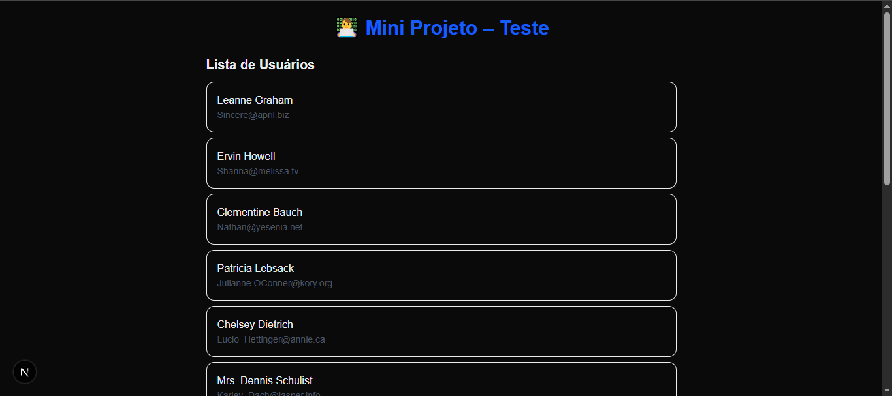
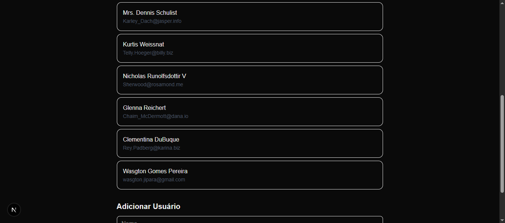
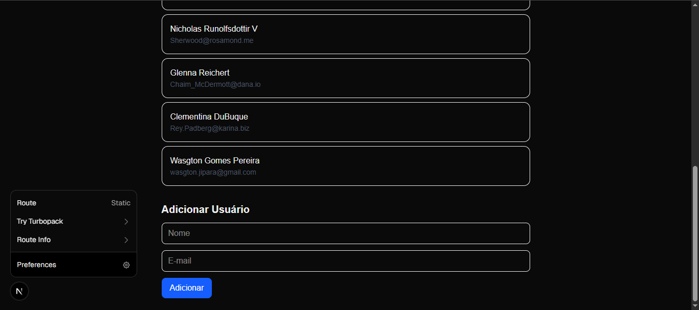

# 👨‍💻 Mini Projeto – Next.js + TypeScript + Tailwind

Aplicação desenvolvida como treino para o **teste prático de Front-End**, utilizando tecnologias modernas do ecossistema **React/Next.js** com foco em **boas práticas, responsividade e integração com API**.

---

## 🚀 Tecnologias utilizadas


---

## 🎯 Funcionalidades
- 🔗 Consumo de API REST pública (**JSONPlaceholder**)  
- 📋 Exibição de lista dinâmica de usuários  
- 📝 Formulário controlado para adicionar novos usuários  
- 📱 Estilização responsiva com Tailwind CSS  
- 💾 Versionamento com **Git** e hospedagem no **GitHub**  

---

## 📂 Estrutura do projeto

Abaixo está a organização principal dos diretórios e arquivos deste repositório:


```sh
mini-projeto/
├─ app/ # Páginas e componentes principais
│ └─ page.tsx # Página inicial (lista + formulário)
├─ public/ # Arquivos estáticos (imagens, ícones, etc.)
├─ styles/ # Estilos globais (Tailwind)
├─ package.json # Configuração do projeto e dependências
└─ README.md # Documentação
```
---

## 🖼️ Demonstração

### Tela inicial com lista de usuários


### Formulário para adicionar usuário


### Lista atualizada após inserir usuário


---

## ⚙️ Como rodar o projeto
Clone este repositório e execute os comandos abaixo:

```sh
# Instalar dependências
npm install

# Rodar em modo de desenvolvimento
npm run dev
```
## Acesse em: http://localhost:3000


##📌 Observações

- 📚 Projeto criado para fins de estudo e simulação de teste prático de seleção

- 🤖 Sem uso de IA no código.

- ✅ Apenas documentação oficial das tecnologias foi utilizada como referência